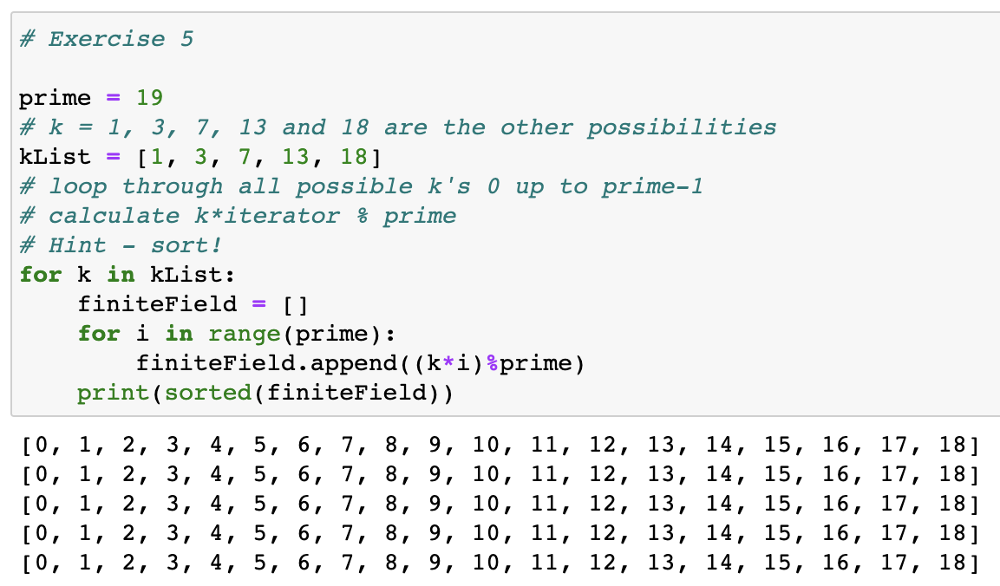

### Intro

유한체는 타원곡선 암호를 파악하기 위해 필요하고, 타원곡선 암호는 비트코인의 핵심인 전자서명과 서명 검증 알고리즘을 이해하는 데 필수이다.

### 유한체 정의

1. a와 b가 집합에 속해 있으면, a+b와 a⋅b도 집합 안에 있다(집합 위에 두 연산 +, ⋅이 닫혀 있음).
1. 집합에 0으로 표기하는 원소가 존재하고 집합 내 다른 원소 a와 + 연산 결과는 a다. 즉 a+0=a(+ 연산에 대한 항등원 존재).
1. 집합에 1로 표기하는 원소가 존재하고 집합 내 다른 원소 a와 ⋅ 연산 결과는 a다. 즉 a⋅1=a(⋅ 연산에 대한 항등원 존재).
1. 집합의 원소 a와 + 연산 결과가 0이 되게 하는 원소 b가 역시 집합에 속해 있고 이러한 b를 -a로 표기한다(+ 연산에 대한 a의 역원 -a 존재).
1. 0이 아닌 집합의 원소 a에 대해 a⋅b=1이 되게 하는 원소 b가 역시 집합에 속해 있고 이러한 b를 a-1로 표기한다(⋅ 연산에 대한 a의 역원 a-1 존재).

### 유한집합 정의하기

유한체의 집합은 보통 다음과 같이 표기한다.

&nbsp;&nbsp;&nbsp; <em>F</em>p = {0, 1, 2, ... , p-1}

<em>F</em>p는 위수 p의 유한체라고 읽는 특정 유한체이다.(여기서 p는 집합의 위수로 집합 안의 원소 개수이다).

예를 들어, 위수 11의 유한체는 다음과 같다.

&nbsp;&nbsp;&nbsp; <em>F</em>11 = {0, 1, 2, 3, 4, 5, 6, 7, 8, 9, 10}

위수 983의 유한체는 다음과 같이 쓸 수 있다.

&nbsp;&nbsp;&nbsp; <em>F</em>983 = {0, 1, 2, ... , 982}

유한체의 위수는 항상 0부터 p-1까지 인 것을 확인할 수 있다. 또한, 유한체는 위수가 소수prime number인 것을 볼 수 있다. 여러가지 이유로 인해 유한체의 위수는 반드시 소수이거나 소수의 거듭제곱이 되어야 하는데, 이는 나중에 알아보도록 하자.

### 나머지연산 (Modulo Arithmetic)

우리는 나머지연산으로 덧셈, 뺄셈, 곱셈, 나눗셈에 대해 닫혀 있는 유한체를 만들 수 있다. 간단히 말하자면, 나머지연산은 하나의 수를 다른 수로 나눈 나머지이다. 아래의 예를 살펴보자.

&nbsp;&nbsp;&nbsp; 7 % 3 = 1 
&nbsp;&nbsp;&nbsp; 1747 % 241 = 60

이렇듯 나머지연산(%)의 결과는 항상 0 이상, 제수(divisor) 미만의 값이다. 아무리 큰 숫자라도 나머지연산 후 비교적 작은 범위의 숫자로 변환되기 때문에 숫자 개수가 한정되어 있는 유한체에서 매우 적절한 속성이 된다.

### 유한체 연산

유한체에서 연산을 할 때 그 결과가 여전히 유한체에 속해 있도록 해야 한다. 즉 수학 용어로 유한체에서 연산이 닫혀 있도록 해야 한다는 것이다.

**덧셈과 뺄셈**

유한체 덧셈은 다음과 같이 정의한다.

&nbsp;&nbsp;&nbsp; a +f b = (a + b) % p (여기서 a, b ∈ <em>F</em>p)

유한체에서의 덧셈은 임의의 수 2개를 꺼내서 더하고 그 수를 위수로 나눈 나머지를 구하면 된다. 예를 들어, 19를 위수로 하는 유한체에서 11 +f 17 = 9가 되어 모든 덧셈의 결과가 유한체 <em>F</em>19에 속하게 되는 것이다.

덧셈에 대한 역원도 이런 식으로 정의하는데, a ∈ <em>F</em>p이면 -ap ∈ <em>F</em>p가 성립함을 의미하고 -ap는 다음과 같이 구한다.

&nbsp;&nbsp;&nbsp; -fa = (-a) % p 

비슷하게 유한체에서의 뺄셈도 정의할 수 있다.

&nbsp;&nbsp;&nbsp; a -f b = (a - b) % p (여기서 a, b ∈ <em>F</em>p)

**곱셈과 거듭제곱**

유한체에서 닫혀 있는 덧셈(+f)을 정의했듯이 유한체에서 닫혀 있는 곱셈도 정의할 수 있다. 이를 이용하면 거듭제곱도 정의할 수 있다. 단도직입적으로 말하자면 계산은 정수집합의 곱셈을 유한체의 위수로 나눈 나머지이며 결과는 당연히 유한체 <em>F</em>p에 속한다. F19에서 예를 들면 다음과 같다.

&nbsp;&nbsp;&nbsp; 8 ⋅f 17 = (8 ⋅ 17) % 19 = 136 % 19 = 3

거듭제곱도 마찬가지이다. <em>F</em>19에서 예를 들면 다음과 같다.

&nbsp;&nbsp;&nbsp; 73 = (7 ⋅ 7 ⋅ 7) % 19 = 343 % 19 = 1

**나눗셈**

유한체에서의 나눗셈 역시 결과값이 유한체에 속해야 한다. 그러나 유한체에서의 나눗셈은 일반 수학 상식에서의 나눗셈과 다소 다르다. <em>F</em>19에서의 예를 통해 알아보자.

&nbsp;&nbsp;&nbsp; 3 ⋅f 7 = 21 % 19 = 2로부터 2 /f 7 = 3이라는 등식이 성립한다. 
&nbsp;&nbsp;&nbsp; 9 ⋅f 5 = 45 % 19 = 7로부터 7 /f 5 = 9이라는 등식이 성립한다.

여기서 의문이 드는 사항은 3 ⋅f 7 = 2를 모르는 상황에서 어떻게 2 /f7를 계산하는가 이다. 나눗셈은 곱셈의 역연산이므로 위와 같은 상황을 다음과 같이 일반화하여 나타낼 수 있다.

&nbsp;&nbsp;&nbsp; a / b = a ⋅f (1 / b) = a ⋅f b-1

여기서 b-1을 계산하면 나눗셈 문제가 곱셈 문제로 바뀌게 된다. 여기서 <strong>페르마의 소정리</strong>를 이용하여 계산할 수 있다. 페르마의 소정리는 다음과 같다.

&nbsp;&nbsp;&nbsp; n(p-1) % p = 1 (여기서 p는 소수)

우리는 소수를 위수로 하는 유한체를 사용하기 때문에 이 정리를 사용할 수 있다. 페르마 소정리에 따르면,

&nbsp;&nbsp;&nbsp; b(p-1) = 1

이고 p는 소수이기에

&nbsp;&nbsp;&nbsp; b-1 = b-1 ⋅f 1 = b-1 ⋅f b(p-1) = b(p-2)

이를 요약하면 다음과 같다.

&nbsp;&nbsp;&nbsp; b-1 = b(p-2)

유한체 <em>F</em>19에서 0이 아닌 모든 원소 b에 대해 b18 = 1을 의미하므로 b-1 = b17을 의미한다. 따라서 어떤 원소 b의 역원 b-1은 거듭제곱을 통해 계산할 수 있다. <em>F</em>19 에서의 예를 들면 다음과 같다.

&nbsp;&nbsp;&nbsp; 2 /19 7 = 2 ⋅19 7(19-2) = 2 ⋅19 717 = 3 
&nbsp;&nbsp;&nbsp; 7 /19 5 = 7 ⋅19 5(19-2) = 7 ⋅19 517 = 9

### 왜 위수가 소수인 유한체가 유용할까?

책 p.49의 [연습문제 1.5]를 풀어보자.

<strong>연습문제 1.5</strong> k가 각각 1, 3, 7, 13, 18인 경우 <em>F</em>19에서 다음 집합을 구하고, 구한 집합에서 어떤 규칙성이 있는지 찾으시오.

&nbsp;&nbsp;&nbsp; {k ⋅f 0, k ⋅f 1, k ⋅f 2, k ⋅f 3, ..., k ⋅f 18}

<figure>

</figure>

[연습문제 1.5]를 풀어보면 모두 같은 집합이라는 것을 확인할 수 있다. 유한체에 0이 아닌 임의의 원소 k로 전체 집합을 곱할 때 그 결과는 다시 원래 집합이 되는 것이다.

그런데 유한체가 이러한 성질을 가지려면 위수가 소수여야 한다. 만약 유한체의 위수가 합성수이고 k와의 최대공약수가 1이 아니라면 중복된 원소가 발생하기 때문에 원래의 유한집합의 크기보다 작아지게 된다. p = 6일 때를 예로 들어보자.

&nbsp;&nbsp;&nbsp; <em>F</em>6 = {0, 1, 2, 3, 4, 5}

여기에 k가 각각 2, 3, 4, 5인 경우를 구해보자.

&nbsp;&nbsp;&nbsp; k = 2) <em>F</em> = {0, 2%6, 4%6, 6%6, 8%6, 10%6} = {0, 2, 4} 
&nbsp;&nbsp;&nbsp; k = 3) <em>F</em> = {0, 3%6, 6%6, 9%6, 12%6, 15%6} = {0, 3} 
&nbsp;&nbsp;&nbsp; k = 5) <em>F</em> = {0, 5%6, 10%6, 15%6, 20%6, 25%6} = {0, 1, 2, 3, 4, 5}

방금 확인한 바와 같이 위수 p와 k가 1이 아닌 다른 공약수를 가진다면 k가 유한집합의 모든 원소를 곱할 때 k와 서로소인 원소에 대해 이미 존재하는 원소와 중복되게 만든다. 이러한 이유로 <strong>위수가 소수</strong>인 유한체가 유용한 것이다.
